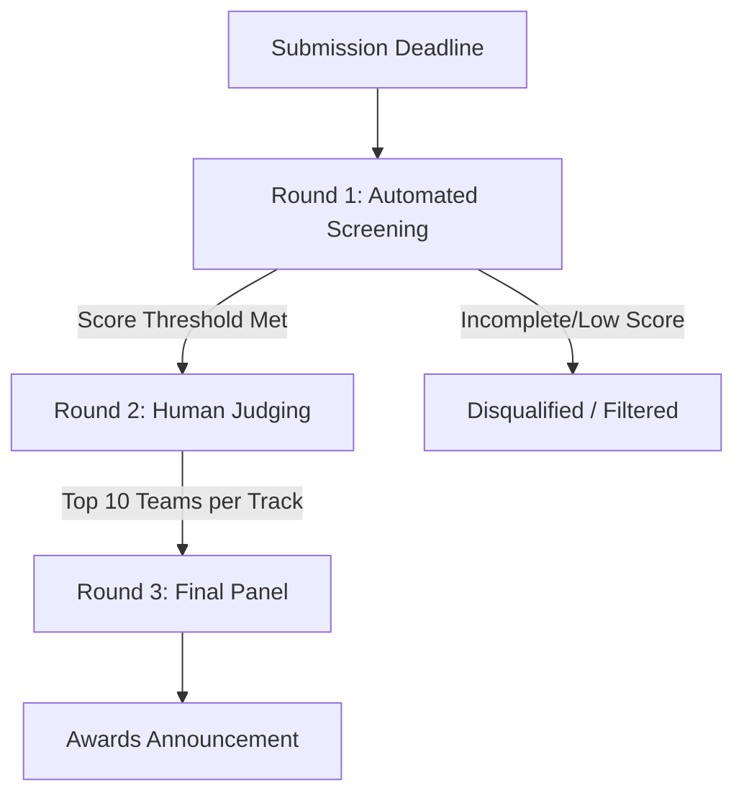

# Project Submission & Judging Guidelines 🏆

This document outlines the evaluation criteria, judging rounds, and best practices for submitting your project to the Devpost panel. Review these guidelines carefully to give your team the best chance of success.

---

## 📅 Evaluation Roadmap Overview

---

## 🤖 Round 1: Automated Screening (June 22)
Within hours of the submission deadline, every project is evaluated and scored automatically by an AI screener. This step is designed to enforce completeness and evaluate the depth of your thinking based on a strict rubric matching the human judging criteria.

### 📝 Required Fields to Complete
The AI reads and evaluates five specific sections of your Devpost submission. **If any of these fields are left blank, your project will not be scored and will not advance.**

*   **Elevator Pitch**
*   **About the Project**
*   **AI Architecture Explanation**
*   **Human-in-the-Loop Decision**
*   **Responsible AI Guardrail**

### 🎯 What the AI Evaluates
> [!IMPORTANT]
> The automated screener looks for concrete answers to these five core questions:
> 1.  **Real Problem & Specific User**: Is the problem well-defined and targeted at a specific user group (rather than just generic "people" or "students")?
> 2.  **Justified AI Capability**: Is AI the correct tool for the job? Is the specific AI capability (e.g., NLP, classification, RAG, recommendation engine) named and technical fit justified?
> 3.  **End-to-End System Flow**: Does the solution feature a clear data pipeline: `Input` $\rightarrow$ `AI Process` $\rightarrow$ `Output`?
> 4.  **Human Oversight Point**: Does the team demonstrate exactly where human operators maintain control? Is there a designated handoff point?
> 5.  **Concrete Mitigation Guardrail**: Is there a real, specific risk identified for this solution, and did you describe a concrete product design choice that reduces this risk?

> [!NOTE]
> **A note on AI writing detectors**: We **do not** use AI detectors (like ZeroGPT or GPTZero) during screening. What matters is the depth and quality of your thinking. If you used AI to help edit your grammar or writing style, simply disclose it in the **AI Tools Used** field.

---

## 👥 Round 2: Human Judging (June 22–25)
Submissions that pass the Round 1 screening threshold are assigned to an expert human judge within their specific track. Judges review the full project details, design answers, and your **3–5 minute demo video**.

### 📊 Scoring Criteria (1 to 5 points each)

| Criterion | What Judges Look For |
| :--- | :--- |
| **Problem Understanding** | Is the problem real, well-explained, and validated? |
| **AI Reasoning** | Why is AI necessary here? Is the technical approach sound and justified? |
| **Solution Design & Architecture** | Does the system design make logical sense end-to-end? |
| **Impact & Decision Value** | What changes in the real world for the user because your AI exists? |
| **Responsible AI & Ethics** | Did you think seriously about bias, oversight, and ethical risks? |

*Your Round 1 screening score is combined with the Round 2 human scores to determine your final standing. The top 10 teams per track advance to the Final Panel.*

> [!TIP]
> **The Demo Video is Crucial**: Judges heavily prioritize seeing a working prototype or a clear walkthrough of the AI in action. Source code is not required; focus on showcasing functionality in the video.

---

## 🏆 Round 3: Final Panel (June 25–26)
A panel of **5 expert judges** evaluates the top 10 finalists from each track to award the following prizes:

*   🥇 **Grand Prize**
*   🥈 **Runner-Up**
*   🥉 **Third Place**
*   🛡️ **Responsible AI Award**
*   🌱 **Social Impact Award**

*Winners will be announced live at the Global Awards Showcase on **June 27 at 10:00 AM ET**.*

---

## 💡 How to Give Yourself the Best Chance

1.  **Leave Zero Blanks**: Ensure all 5 required fields are fully written.
2.  **Target a Specific Persona**: Clearly identify who your user is and detail the specific constraints they face.
3.  **Be Explicit with AI Technical Terms**: Name the specific machine learning technique (e.g. classification, RAG, custom embeddings) and detail why it fits.
4.  **Show the Before vs. After**: Clearly paint a picture of how the user's workflow changes because of your AI.
5.  **Define a Localized Risk & Design Choice**: Avoid generic warnings (e.g., "AI can be biased"). Instead, name a risk specific to your app (e.g., "hallucinated roadmap advice") and show your design solution (e.g., "milestone checklists manually verified by the user").
6.  **Create a Practical Video Demo**: Record a clear demo showcasing the prototype, even if parts of it are mockups.
