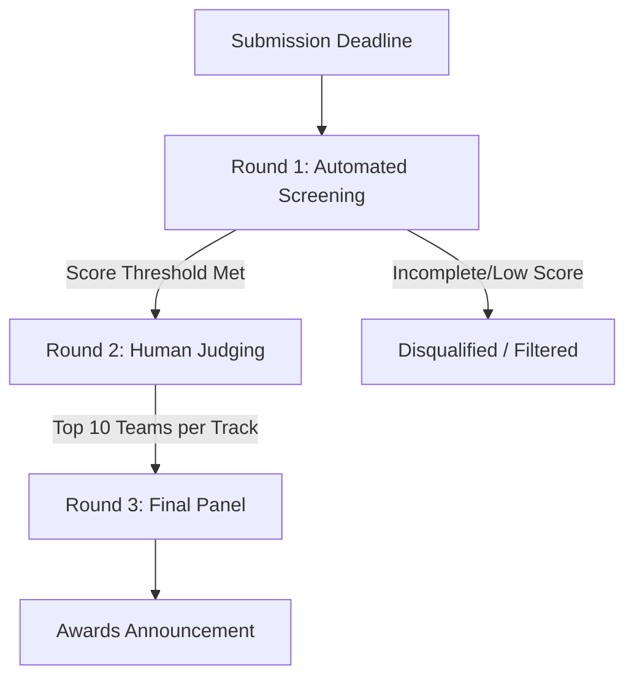

# Project Submission & Judging Guidelines 🏆

This document outlines the evaluation criteria, judging rounds, and best practices for submitting your project to the Devpost panel. Review these guidelines carefully to give your team the best chance of success.

---

## 📅 Evaluation Roadmap Overview

---

## 🤖 Round 1: Automated Screening (June 22)
Within hours of the submission deadline, every project is evaluated and scored automatically by an AI screener. This step is designed to enforce completeness and evaluate the depth of your thinking based on a strict rubric matching the human judging criteria.

### 📝 Required Fields to Complete
The AI reads and evaluates five specific sections of your Devpost submission. **If any of these fields are left blank, your project will not be scored and will not advance.**

*   **Elevator Pitch**
*   **About the Project**
*   **AI Architecture Explanation**
*   **Human-in-the-Loop Decision**
*   **Responsible AI Guardrail**

### 🎯 What the AI Evaluates
> [!IMPORTANT]
> The automated screener looks for concrete answers to these five core questions:
> 1.  **Real Problem & Specific User**: Is the problem well-defined and targeted at a specific user group (rather than just generic "people" or "students")?
> 2.  **Justified AI Capability**: Is AI the correct tool for the job? Is the specific AI capability (e.g., NLP, classification, RAG, recommendation engine) named and technical fit justified?
> 3.  **End-to-End System Flow**: Does the solution feature a clear data pipeline: `Input` $\rightarrow$ `AI Process` $\rightarrow$ `Output`?
> 4.  **Human Oversight Point**: Does the team demonstrate exactly where human operators maintain control? Is there a designated handoff point?
> 5.  **Concrete Mitigation Guardrail**: Is there a real, specific risk identified for this solution, and did you describe a concrete product design choice that reduces this risk?

> [!NOTE]
> **A note on AI writing detectors**: We **do not** use AI detectors (like ZeroGPT or GPTZero) during screening. What matters is the depth and quality of your thinking. If you used AI to help edit your grammar or writing style, simply disclose it in the **AI Tools Used** field.

---

## 👥 Round 2: Human Judging (June 22–25)
Submissions that pass the Round 1 screening threshold are assigned to an expert human judge within their specific track. Judges review the full project details, design answers, and your **3–5 minute demo video**.

### 📊 Scoring Criteria (1 to 5 points each)

| Criterion | What Judges Look For |
| :--- | :--- |
| **Problem Understanding** | Is the problem real, well-explained, and validated? |
| **AI Reasoning** | Why is AI necessary here? Is the technical approach sound and justified? |
| **Solution Design & Architecture** | Does the system design make logical sense end-to-end? |
| **Impact & Decision Value** | What changes in the real world for the user because your AI exists? |
| **Responsible AI & Ethics** | Did you think seriously about bias, oversight, and ethical risks? |

*Your Round 1 screening score is combined with the Round 2 human scores to determine your final standing. The top 10 teams per track advance to the Final Panel.*

> [!TIP]
> **The Demo Video is Crucial**: Judges heavily prioritize seeing a working prototype or a clear walkthrough of the AI in action. Source code is not required; focus on showcasing functionality in the video.

---

## 🏆 Round 3: Final Panel (June 25–26)
A panel of **5 expert judges** evaluates the top 10 finalists from each track to award the following prizes:

*   🥇 **Grand Prize**
*   🥈 **Runner-Up**
*   🥉 **Third Place**
*   🛡️ **Responsible AI Award**
*   🌱 **Social Impact Award**

*Winners will be announced live at the Global Awards Showcase on **June 27 at 10:00 AM ET**.*

---

## 🤝 Real-World Example: Human-in-the-Loop in Action

To understand how **MindX** implements Human-in-the-Loop, read this simple story:

### 🌿 The Story of Sarah & her Plant Swap Idea

#### Act 1: The AI Suggests the Route
Sarah has a dream: she wants to build a mobile app where local gardeners can trade plant clippings. She inputs this vague idea into **MindX**. 

The AI does its magic and builds a custom validation roadmap. It says: *"Your first milestone is **Problem-Solution Fit**. You need to talk to 5 local gardeners in the real world and ask them if they actually struggle to trade clippings. Here is your first step: go post on a local gardening group."*

#### Act 2: The AI Hands Over the Steering Wheel (The Handoff)
At this point, **the AI stops**. It cannot go onto Facebook for Sarah. It cannot knock on doors, and it cannot talk to gardeners. 

The application locks Stage 2 (creating the mockup). Sarah cannot proceed to design her app yet. The AI has handed complete control back to Sarah (the human).

#### Act 3: The Human Validates the Ground
Sarah goes out into the real world. She posts on the local gardening forum, gets 10 replies from excited gardeners, and interviews them. She learns that people *do* struggle to find rare clippings, but their biggest worry is plant pests. 

Now armed with real-world human feedback, Sarah returns to the MindX dashboard. She manually checks off the completion gate box: **"I have interviewed 5 gardeners."** 

#### Act 4: The Loop Continues
By checking the box, Sarah unlocks Stage 2. The AI wakes up again, reads her notes about "pests," and adapts: *"Since pests are a major worry, Stage 2 is to draw a paper prototype showing a 'pest check' badge on listings. Now go show it to those same gardeners."* Once again, the AI stops, hands control to Sarah, and waits for her real-world approval.

### 💡 Simply Put:
*   **The AI is the Navigator**: It draws the map and suggests the directions.
*   **The Human is the Driver**: The human must actually step on the gas, test the road (talk to real users), and manually confirm they reached the checkpoint before the navigator gives them the next turn. 
*   **The Handoff Point**: The **Roadmap Gate Checkboxes** in the UI. The AI is forbidden from crossing them; only human action can unlock the next stage.

---

---

## 💡 How to Give Yourself the Best Chance

1.  **Leave Zero Blanks**: Ensure all 5 required fields are fully written.
2.  **Target a Specific Persona**: Clearly identify who your user is and detail the specific constraints they face.
3.  **Be Explicit with AI Technical Terms**: Name the specific machine learning technique (e.g. classification, RAG, custom embeddings) and detail why it fits.
4.  **Show the Before vs. After**: Clearly paint a picture of how the user's workflow changes because of your AI.
5.  **Define a Localized Risk & Design Choice**: Avoid generic warnings (e.g., "AI can be biased"). Instead, name a risk specific to your app (e.g., "hallucinated roadmap advice") and show your design solution (e.g., "milestone checklists manually verified by the user").
6.  **Create a Practical Video Demo**: Record a clear demo showcasing the prototype, even if parts of it are mockups.
